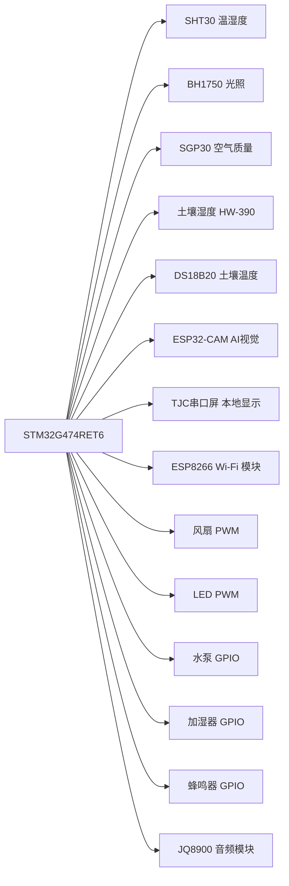
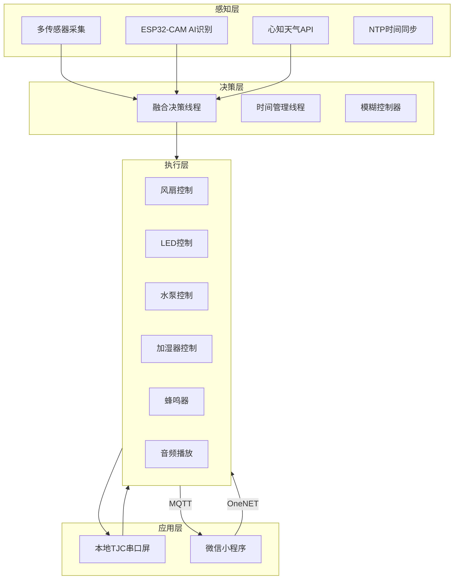

# xing
竞赛（基于RT-thread STM32G474的菌菇养殖系统）
# 基于 RT-Thread 的菌菇种植智能监控系统

 一套集多传感器融合、边缘 AI 视觉识别、模糊逻辑控制、云端远程监控于一体的智能菌菇养殖解决方案，实现从“感知→决策→执行→记录”的全链路闭环管理。

## 📖 项目简介

传统菌菇养殖依赖人工经验，面临环境波动大、多品种轮作切换困难、数据无法沉淀等瓶颈。本项目基于 **STM32G474RET6** 与 **RT-Thread 实时操作系统**，设计并实现了一套智能菌菇养殖监测系统。系统通过 **20+ 个独立线程** 的高效协同，结合 **消息队列、邮箱、事件集** 等多种 IPC 机制，构建了覆盖环境感知、AI 品种识别、模糊控制决策、云边交互的完整智能化平台。

**核心创新**：
- **AI 视觉驱动品种自适应**：ESP32‑CAM 边缘运行 MobileNetV2 模型，实时识别红菇、蓝菇等 5 类菌菇，自动加载对应环境目标参数，实现“一机多用”。
- **声频助长技术**：集成 JQ8900 音频模块，定时播放经生物学验证的混合声频（古典乐+蟋蟀鸣声），不增加水肥投入，实测增产 **12.3%**。
- **融合天气预报的模糊控制**：Mamdani 型模糊控制器结合 80% 棚内实测 + 20% 天气预报温度，动态调整目标区间，具备前馈调节能力。
- **多 IPC 协同的“数据-命令-事件”架构**：充分利用 RT-Thread 的 IPC 机制，实现高并发、低耦合的系统内部通信。

---

## 🏗️ 系统架构

### 硬件架构

系统以 STM32G474RET6 为主控，外接多类传感器、执行器及通信模块，整体硬件连接关系如下：



### 软件架构

基于 RT-Thread 的分层模块化设计，自底向上分为：

- **硬件抽象层**：HAL 库 + RT-Thread 设备驱动框架（I2C、ADC、PWM、UART、RTC、WDT）
- **驱动层**：各传感器/执行器的具体驱动实现
- **系统服务与通信层**：IPC 枢纽（消息队列、邮箱、事件集、互斥量、内存池），网络服务（OneNET MQTT、WebClient）
- **应用决策与交互层**：20 个独立线程（采集、融合、控制、显示、上传、网络等）



---

## 🎯 主要功能

| 模块             | 功能描述                                                                                     |
| ---------------- | -------------------------------------------------------------------------------------------- |
| **环境感知**     | 周期性采集空气温湿度、光照、CO₂/TVOC、土壤温湿度，并经过滑动平均/指数平滑滤波，保证数据稳定 |
| **AI 视觉识别**  | ESP32‑CAM 本地推理 MobileNetV2 模型，5 次多数投票输出菌菇种类（红/蓝/绿/云/黄菇），准确率≥95% |
| **模糊控制决策** | Mamdani 型模糊控制器（温度误差+误差变化率，5×5 规则表），输出风扇转速与 LED 亮度              |
| **自适应参数**   | 根据 AI 识别结果自动加载对应品种的 9 维环境目标（温湿度、光照、CO₂等），实现“因种制宜”       |
| **声频助长**     | 每日 8:30-11:30、14:00-17:00 自动播放混合声频，促进菌菇生长                                  |
| **执行器控制**   | 风扇/ LED 无级调速（PWM），水泵/加湿器/蜂鸣器开关控制（GPIO），音频模块串口控制              |
| **本地交互**     | TJC 串口屏实时显示环境数据、执行器状态、三天天气预报，支持触摸手动控制                         |
| **云端交互**     | OneNET MQTT 属性上报（6s 周期），接收小程序远程命令，支持天气获取与 NTP 时间同步              |
| **报警系统**     | 环境参数超限时触发本地蜂鸣器、串口屏提示及云端告警，支持手动清除                              |

---

## 🔬 核心技术点

- **多 IPC 协同通信**：消息队列（传感器分发+执行器命令）、邮箱（手动命令投递）、事件集（报警/定时/更新事件）、互斥量（共享数据保护）、内存池（命令零拷贝）。
- **边缘 AI 推理**：ESP32‑CAM 使用 TensorFlow Lite 运行 MobileNetV2，单次推理 <200ms，结合串口帧解析与多数投票。
- **模糊控制工程化**：三角形隶属度函数、重心法解模糊，在 STM32G4 上以 2ms 完成计算，输出平滑控制量。
- **温度加权融合**：80% 棚内实测 + 20% 天气预报温度，动态调整目标上下限，提升抗扰动能力。
- **硬件感知风扇驱动**：启动门槛 30% PWM，配合状态机与死区滤波，避免低速堵转与频繁启停。
- **基线管理+湿度补偿**：SGP30 传感器内置 Flash 基线存储与绝对湿度补偿，保障长期运行精度。

---

## 📊 性能指标

| 项目                       | 指标                                                                 |
| -------------------------- | -------------------------------------------------------------------- |
| 温度控制精度               | ±0.5℃                                                               |
| 湿度控制精度               | ±5% RH                                                              |
| AI 视觉识别准确率          | ≥95% (5 类菌菇)                                                     |
| 产量提升                   | 12.3%（声频助长实验数据）                                            |
| 损失率降低                 | 85%                                                                 |
| 数据上传周期               | 6 秒（可配置）                                                      |
| 系统平均功耗               | ≤2.5 W                                                              |
| 远程命令响应延迟           | ≤500 ms                                                             |
| 主控频率 / Flash / SRAM    | 170 MHz / 512 KB / 128 KB                                           |

---

## 🚀 快速开始

### 硬件准备
- 主控板：STM32G474RET6（NUCLEO-G474RE 开发板或自制 PCB）
- 传感器：SHT30、BH1750、SGP30、HW-390、DS18B20
- 执行器：12V PWM 风扇、3W LED 灯、12V 水泵、超声波加湿器、有源蜂鸣器、JQ8900 音频模块
- 通信：ESP8266-01S、TJC4827X243_011C 串口屏、ESP32-CAM（带 OV2640）
- 电源：12V/2A 适配器 + LM2596 降压模块

### 软件环境
- IDE：RT-Thread Studio（推荐）或 Keil MDK
- RT-Thread 版本：5.1.0
- 依赖软件包：`at_device`, `onenet`, `cJSON`, `webclient`, `netutils`, `pahomqtt`, `sht3x`, `bh1750`, `sgp30`, `ds18b20`, `cm_backtrace`
- ESP32-CAM 开发：Arduino IDE + Edge Impulse 导出 TensorFlow Lite 模型

### 编译与烧录
1. 克隆本仓库：
   ```bash
   git clone https://github.com/yourname/mushroom-monitor.git
   ```
2. 使用 RT-Thread Studio 导入工程，或使用 Keil 打开 `.uvprojx`。
3. 配置 `rtconfig.h` 中的传感器引脚、Wi-Fi 账号密码、OneNET 三元组。
4. 编译并烧录到 STM32G474。
5. ESP32-CAM 部分单独烧录 `esp32_cam_mushroom.ino`（需配置 Wi-Fi 和串口参数）。
6. 微信小程序源码位于 `wechat-miniprogram/`，导入微信开发者工具并修改 OneNET API 密钥。

### 运行
- 上电后系统自动启动所有线程，TJC 串口屏显示主界面。
- 通过串口屏或微信小程序可切换手动/自动模式，控制各执行器。
- 数据自动上报至 OneNET 云平台，可在控制台查看实时数据曲线。

---

## 📁 文件结构

```
mushroom-monitor/
├── STM32G474_RTThread/        # STM32 端工程（RT-Thread Studio）
│   ├── applications/          # 应用层源码（线程、融合、通信等）
│   ├── drivers/               # 板级驱动（HAL 配置）
│   ├── board/                 # 板级支持包
│   └── rtconfig.h             # 系统配置
├── ESP32_CAM/                 # ESP32-CAM 视觉识别源码（Arduino）
│   ├── esp32_cam_mushroom.ino # 主程序，含 Edge Impulse 推理
│   └── model/                 # 导出的 TFLite 模型
├── TJC_Screen/                # TJC 串口屏工程文件（.tft 工程）
├── WeChat_MiniProgram/        # 微信小程序源码
├── docs/                      # 技术报告、原理图、PCB 文件
└── README.md                  # 本文件
```

---

## 👥 贡献者

- **作者**：Your Name（可根据实际情况填写）
- **指导老师**：XXX 教授
- **相关博客**：[CSDN 技术分享](https://blog.csdn.net/xxx)（记录调试过程中的典型问题与解决方案）

---

## 📜 许可证

本项目采用 **MIT 许可证**，详情见 [LICENSE](LICENSE) 文件。

---

## 📞 联系与交流

如有问题或建议，欢迎提交 Issue 或通过以下方式联系：
- Email：yourname@example.com
- 微信公众号：智能菌菇养殖

---

**⭐ 如果这个项目对您有帮助，请点个 Star 支持一下！**
